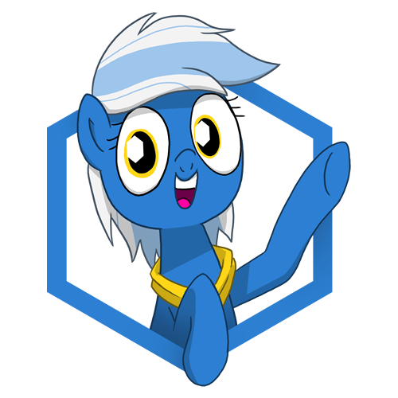

# Ponyville Live!
_Bringing pony people together_

## Building
Right now, building is a bit complex. First, install the required npm modules
```bash
npm install && cd app && npm install && cd ..
```

Next, build the app's source code:
```bash
cd app && npm run build && cd ..
```

Lastly, build the app
```bash
npm run pack
```

You should now have `dist/<platform>/<executable>`, for example `dist/mac/Ponyvillie Live!.app`